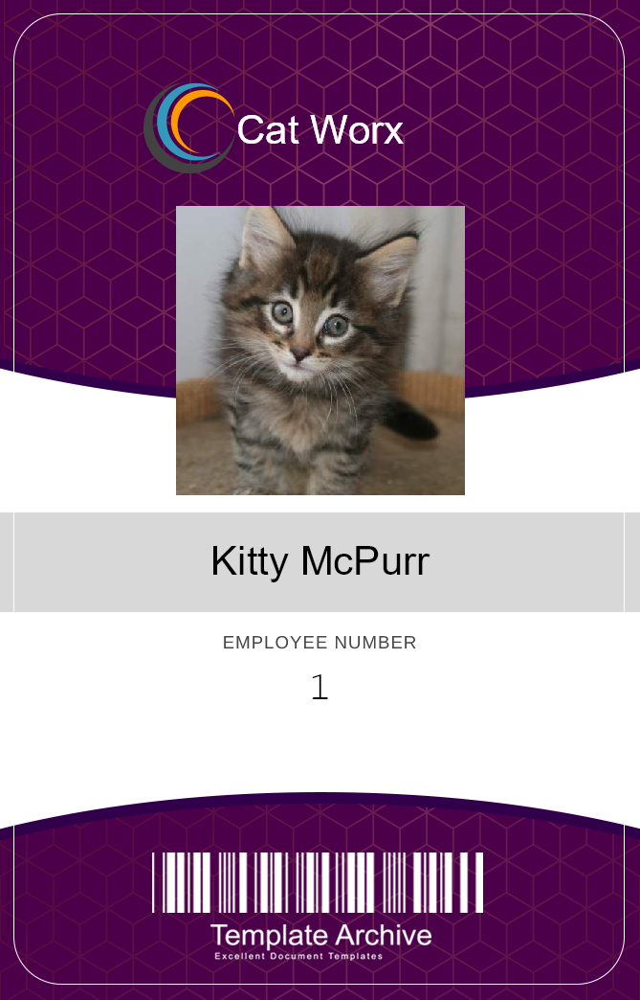

# first-C--application

# Description
- This is my first C# application I am building and storing notes in as I learn and use my bootcamp continuation courses.

- As I continue to go through the learning process of dotnet and C# this repository will continue to change significantly. 

- I will update this README as the app changes

- This application creates employee badges using SkiaSharp. It will print employee image, name and number onto a badge using the terminal.

# Usage
- After cloning the repo, assuming you have .NET Core 5.0 installed, use `dotnet run` command in your terminal, type in the employee information and the badge should be populated in the data folder

# Credits
- The instructors at the UofM Bootcamp for getting me started in my Coding career and a building a solid foundation in coding in which to grow on

- The University of Minnesota for providing awesome continuation courses in other programming languages 

